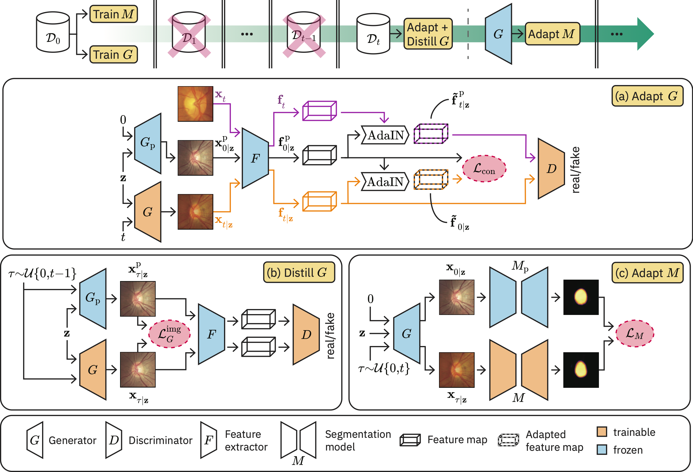

# Generative Appearance Replay

Generative Appearance Replay is a novel segmentation method for strictly continual domain adaptation wherein no access to the source domain or other previously seen domains is required.
This repository contains the PyTorch code of our corresponding paper [Generative appearance replay for continual unsupervised domain adaptation](https://www.sciencedirect.com/science/article/pii/S1361841523001846).

## Overview


## Installation
Create a conda environment and install the required packages from the provided `environment.yml`:

```
git clone https://github.com/histocartography/generative-appearance-replay
cd generative-appearance-replay
conda env create -f environment.yml
conda activate garda
```

Install pytorch and torchvision:

```
conda install pytorch==1.10.1 torchvision==0.11.2 -c pytorch
```

## Datasets
We evaluated our method for three different segmentation tasks:

- **Optic disc segmentation (ODS)**: 
    - Datasets:
        - Source domain: images from [REFUGE](https://refuge.grand-challenge.org/REFUGE2Download/) taken with a Canon device
        - Target domain 1: all images from [IDRiD](https://idrid.grand-challenge.org) (taken with a Kowa device)
        - Target domain 2: images from [RIM-ONE](https://github.com/miag-ull/rim-one-dl) taken with a Nidek device
    - Preprocessing adopted from [this repository](https://github.com/askerlee/segtran/blob/master/code/MNet_DeepCDR/Step_1_Disc_Crop.py)
    - train/val/test splits and lists of all images can be found under `doc/ods_splits/`

- **Cardiac segmentation (CS)**:
    - Images of 3 different vendors from the [M&Ms dataset](https://www.ub.edu/mnms/)
    - Datasets:
        - Source domain: vendor B
        - Target domain 1: vendor A
        - Target domain 2: vendor D
    - Preprocessing adapted from [this repository](https://github.com/vios-s/cardiac_dataset_trasformer/tree/main). We added bias field correction, resized the images to 256x256 instead of 224x224, used "constant" instead of "edge" padding, and saved the ground truth masks as 1-channel .npy matrices with values 0 (background), 1 (left ventricle myocardium), 2 (left ventricle), and 3 (right ventricle) 
    - train/val/test splits and lists of all images can be found under `doc/cs_splits/`
    
- **Prostate segmentation (PS)**: 
    - Images of 6 different sites from the [Multi-site Prostate Segmentation dataset](https://liuquande.github.io/SAML/)
    - Datasets:
        - Source domain = RUNMC (renamed to Site_A)
        - Target domain 1 = BMC (renamed to Site_B)
        - Target domain 2 = I2CVB (renamed to Site_C)
        - Target domain 3 = UCL (renamed to Site_D)
        - Target domain 4 = BIDMC (renamed to Site_E)
        - Target domain 5 = HK (renamed to Site_F)
    - Preprocessing can be found in `bin/preproc_ps.py` (adapted from [this repository](https://github.com/liuquande/MS-Net/blob/master/data_loader.py))
    - train/val/test splits and lists of all images can be found under `doc/ps_splits/`


## Getting started

Below we provide example instructions on how to run preprocessing, as well as how to adapt a segmentation model and a GAN for prostate segmentation over a sequence of domains, given the sample config files under `source/config/ps/`.

### Preprocessing

Preprocess the data downloaded from https://liuquande.github.io/SAML/ :

```
python bin/preproc_ps.py --in_path /path/to/data/raw/ --out_path /path/to/data/preprocessed/
```

This will create the following directory structure:

```
/path/to/data/preprocessed/
├── Site_A/
    └── all_slides.csv
    └── split.csv
    └── images/
        └── Case00_Site_A_slice00.png
        └── Case00_Site_A_slice01.png
        :
    └── masks/
        └── Case00_Site_A_slice00.npy
        └── Case00_Site_A_slice01.npy
        :
├── Site_B/
:
├── Site_F/
```

### Training and testing

1. Train the segmentation model on the source domain:

    ```
    python bin/run.py --data_path /path/to/data --config_path source/config/ps/src_seg_train.json --task ps
    ```

2. Train the GAN on the source domain:

    ```
    python bin/run.py --data_path /path/to/data --config_path source/config/ps/src_gen_train.json --task ps
    ```

3. Adapt the GAN to a target domain:

    ```
    python bin/run.py --data_path /path/to/data --config_path source/config/ps/tgt1_gen_train.json --task ps
    ```

4. Adapt the segmentation model to a target domain:

    ```
    python bin/run.py --data_path /path/to/data --config_path source/config/ps/tgt1_seg_train.json --task ps
    ```

Steps 3 and 4 are then repeated accordingly for every additional target domain.

To test the model, set the config field `"task"` to `"test_seg"` and provide the path of the model to be tested in the field `"seg_model_path"`, as shown in `source/config/ps/tgt5_seg_test.json`.


## Citation
If you use this code, please make sure to cite our work:

```
@article{chen2023garda,
    title = {Generative appearance replay for continual unsupervised domain adaptation},
    journal = {Medical Image Analysis},
    volume = {89},
    pages = {102924},
    year = {2023},
    author = {Boqi Chen and Kevin Thandiackal and Pushpak Pati and Orcun Goksel},
}
```